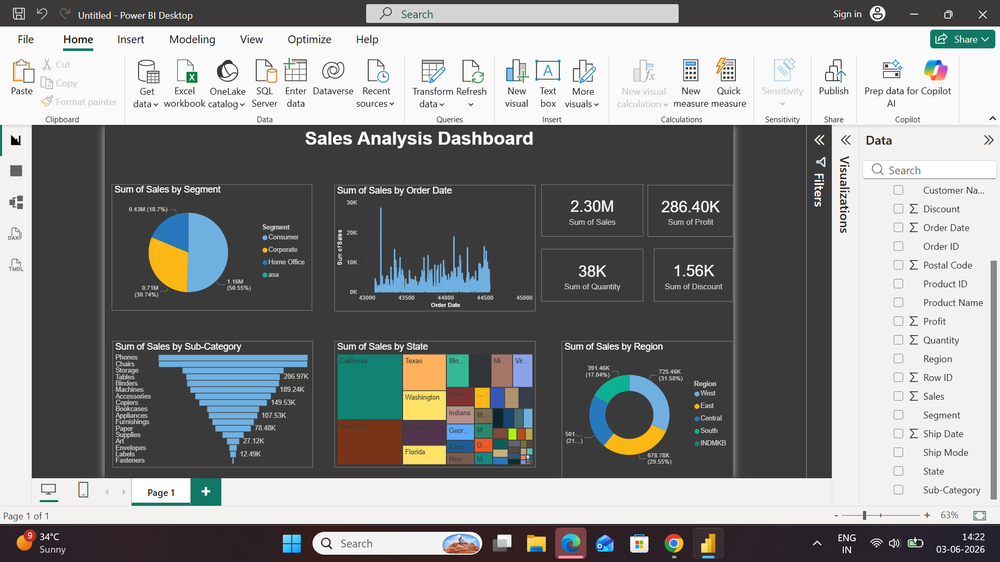

# Sales Analysis Dashboard - Power BI

## 📊 Overview
Interactive Power BI dashboard analyzing Superstore data with 9,994 records. Tracks 2.30M Sales & 286.40K Profit across segments, regions, states, and sub-categories.

## 🎯 Key Highlights
- **Consumer segment**: 51% sales share
- **Top region**: West with 31% revenue  
- **Top states**: California, New York, Texas
- **Best sub-categories**: Phones, Chairs, Storage

## 📸 Dashboard Preview

## 🛠️ Tech Stack
Power BI Desktop, DAX, Data Visualization

## 📂 Files
- `Sales-Analysis-Dashboard-Powerbi.pbix` - Dashboard file
- `Sales-Analysis-Dataset.xlsx` - Raw data
